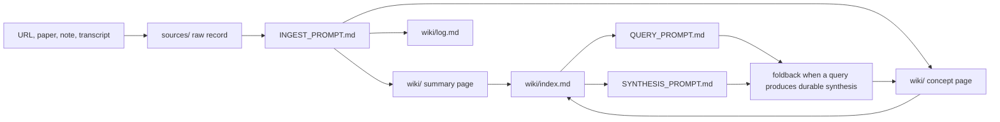
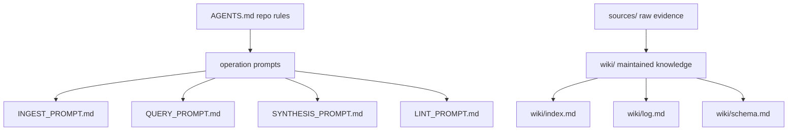

# llm-wiki

A markdown-first, local-first personal knowledge wiki designed to be maintained collaboratively with LLM agents (Claude Code, Codex, or any capable coding agent). Compatible with Obsidian for live review.

Use it to capture sources, turn them into durable summaries and concepts, and query your own growing knowledge base without adding a database, sync service, or ingestion pipeline.

---

## How It Works

The wiki separates raw material from interpreted knowledge. Sources are preserved first; synthesis is added only when it earns a place in the wiki.



## Repo Architecture



## Example Agent Requests

```text
Ingest this source: https://example.com/article
```

```text
Query the wiki: What do my notes say about model routing?
```

```text
Run Random Review.
```

## What Foldback Means

Foldback is when an ingest, query, or review session produces a reusable insight that should be written back into the wiki instead of staying in chat.

- During ingest, foldback means updating an existing concept page when a source strengthens, changes, or complicates a durable idea.
- During query, foldback is optional. Most queries are read-only, but a query can reveal a durable synthesis worth adding to a concept page.
- During Random Review, foldback is usually a recommendation unless the session clearly produces durable synthesis.

Foldback should be rare and justified: the test is still **what changed my model of the world?**

---

## Philosophy

This system is built around one core question: **what changed my model of the world?**

Most personal knowledge systems fail because they conflate saving with processing, and processing with synthesis. This wiki separates those into distinct operations. Raw material is captured and preserved. Synthesis is earned, not assumed. The durable/noisy distinction drives every promotion decision.

Six principles guide how agents interact with the wiki:

1. **Think before editing.** State assumptions. Surface ambiguity instead of silently choosing.
2. **Simplicity first.** Prefer the smallest change that solves the actual problem. No speculative abstractions.
3. **Surgical changes.** Touch only files needed for the task. Mention unrelated issues instead of fixing them.
4. **Goal-driven execution.** Convert vague tasks into verifiable outcomes.
5. **Capture before ingestion.** Saving and processing are separate operations.
6. **Durable vs. noisy.** Only promote what changes your model of the world.

---

## File Structure

```
sources/   raw evidence — immutable or minimally edited
wiki/      summaries, concepts, indexes, decisions, and logs
```

That's it. Every addition must answer: **what just broke that requires this?**

- `sources/` is read-from, not rewritten. Formatting fixes are fine; rewording an author's claim is not.
- `wiki/` is LLM-maintained. Edit freely, but cite source files for external claims.
- One append-only log file (`wiki/log.md`) tracks the timeline. Never rewrite history.
- One index file (`wiki/index.md`) is updated on every ingest.

Subfolders under `sources/` are allowed only for large source corpora, immutable text collections, or asset bundles where flattening would break references.

---

## Quick Start

1. Clone or fork this repo.
2. Edit `AGENTS.md`: confirm the repository-root and timezone guidance match your setup.
3. Open the folder in Obsidian for live review as your agent edits files.
4. Start a Claude Code or Codex session in the repo. The agent will read `AGENTS.md` automatically.
5. Say: *"Ingest this source: [URL or file]"* to begin.

---

## Operations

### Ingest
Add a new source to the wiki. Use `INGEST_PROMPT.md` as the agent prompt. The agent will:
- Classify the source (paper, blog, news, video, etc.)
- Create a source record in `sources/`
- Optionally create a summary or concept page in `wiki/`
- Update `wiki/index.md` and append `wiki/log.md`

### Query
Ask a question about your accumulated knowledge. Use `QUERY_PROMPT.md`. The agent reads `wiki/index.md` first, prefers synthesized pages over raw sources, and cites its reasoning.

### Synthesis
Connect, reconcile, or promote knowledge across multiple pages. Use `SYNTHESIS_PROMPT.md`. Synthesis differs from ingest: no new source is required.

### Lint
Health-check the wiki for broken links, malformed headings, missing index entries, and schema drift. Use `LINT_PROMPT.md`. Read-only by default; pass "and fix" to apply repairs.

### Random Review
Ask the agent to run a Random Review session. It picks one existing wiki page, produces a five-bullet refresher, three recall questions, two connection questions, and a foldback recommendation.

---

## Routing by Bottleneck

Match the model to the task's actual bottleneck — not the most capable model available.

| Task | Bottleneck | Use |
|---|---|---|
| Capture / formatting / rename | Speed | Fast, cheap model |
| Routine ingest | Speed + editing | Mid-tier capable model |
| Dense synthesis / promotion | Depth | Frontier model |
| Broad cross-source sweep | Breadth | Frontier model |

Promotion decisions are never delegated to cheap models. A source is promoted only if it changes your model of the world.

---

## Configuration

### Timezone
Replace `<timezone>` in `AGENTS.md`, `INGEST_PROMPT.md`, `LINT_PROMPT.md`, and `wiki/schema.md`. Use any valid timezone value for your environment.

### Project name
Search and replace `LLM Wiki Template` with your wiki's name throughout the files.

---

## Compatible Tools

- **Claude Code** — recommended for long ingest and synthesis sessions; strong context discipline
- **Codex** — good for repo-edit-heavy and tool-heavy tasks
- **Obsidian** — open the repo root as a vault for live markdown review and wikilink navigation
- **Any LLM agent that reads AGENTS.md** — the rules are agent-agnostic

---

## License

This project is licensed under the MIT License. See [LICENSE](LICENSE).
